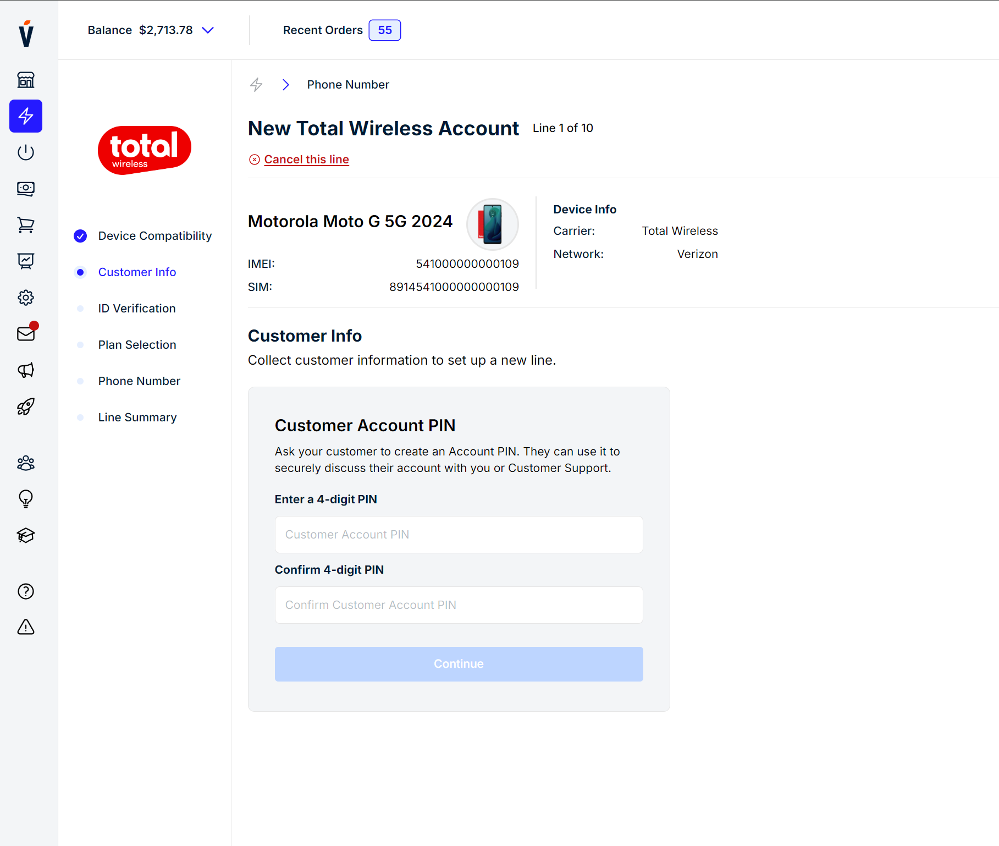

# Getting Started

## Introduction

Welcome to the front-end developer test! In this exercise, you’ll be tasked with recreating a website based on a design image. This test will help assess your skills as well as your ability to translate visual designs into functional web interfaces. Just like you'd lean over and ask your co-workers during your daily tasks, feel free to ask us any clarifying questions!

## Create React App

This project was bootstrapped with [Create React App](https://github.com/facebook/create-react-app).

## Available Scripts

In the project directory, you can run:

### `npm start`

Runs the app in the development mode.\
Open [http://localhost:3000](http://localhost:3000) to view it in your browser.

The page will reload when you make changes.\
You may also see any lint errors in the console.

### `npm test`

Launches the test runner in the interactive watch mode.\
See the section about [running tests](https://facebook.github.io/create-react-app/docs/running-tests) for more information.

### `npm run build`

Builds the app for production to the `build` folder.\
It correctly bundles React in production mode and optimizes the build for the best performance.

The build is minified and the filenames include the hashes.\

# Requirements

## Setup

Using this existing shell, add your implementation to `PinCollection.js`. Tailwind is configured for styling but like anything else, feel free to use any approach you are comfortable with. The data is available in `public/data.json`

### Recreation

Build the web page to match the design image as closely as possible. Pay attention to detail, including font sizes, colors, spacing, and alignment.

### Responsiveness

Use media queries or responsive design techniques to ensure the page looks good on various devices.

### Testing

Test your implementation in different browsers and devices to ensure compatibility and responsiveness.
